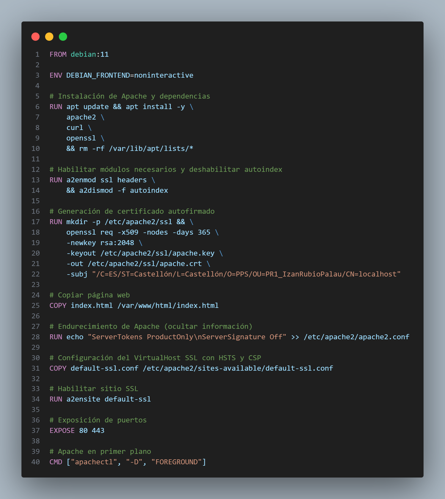
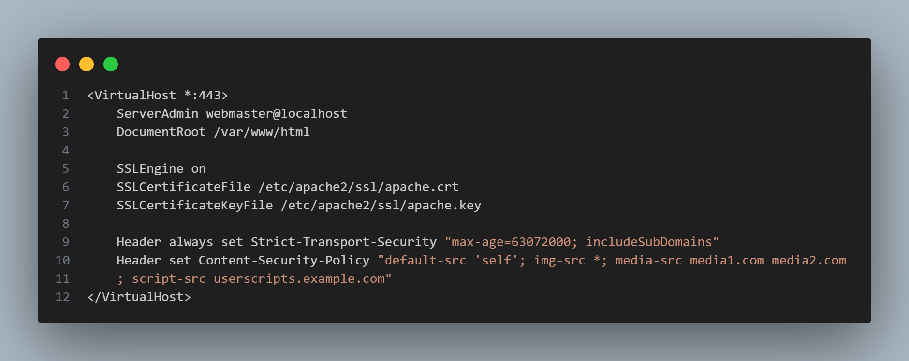

# Apartado 3.1.1 CSP

## Introducción

En esta práctica se ha realizado el endurecimiento (**hardening**) de un servidor web Apache, aplicando distintas medidas de seguridad orientadas a reducir la superficie de ataque, minimizar la exposición de información sensible y proteger las comunicaciones entre cliente y servidor.

Todas las medidas de seguridad se han implementado directamente durante la construcción de una imagen Docker, garantizando así que cualquier contenedor desplegado a partir de dicha imagen mantenga exactamente la misma configuración de seguridad, sin necesidad de configuraciones manuales adicionales en el sistema anfitrión.

Este enfoque sigue los principios de **mínimo privilegio**, **mínima exposición** y **reproducibilidad**, y complementa la seguridad perimetral proporcionada por el firewall y la correcta gestión de usuarios y permisos.

## Uso de Docker como base del hardening

El hardening del servidor se ha realizado utilizando Docker, de manera que toda la
configuración de seguridad queda integrada en la propia imagen.

Esto permite:
- Reproducir el entorno de forma idéntica en cualquier sistema.
- Evitar configuraciones manuales posteriores.
- Utilizar la imagen como base para futuros despliegues.

## Contenido del Dockerfile



## Instalación de Apache y dependencias

Durante la construcción de la imagen se instala el servidor web Apache junto con las herramientas necesarias para habilitar HTTPS y verificar el funcionamiento del servidor.

Se utiliza Debian como sistema base por su estabilidad y uso habitual en entornos de servidor.

## Deshabilitación del módulo autoindex

Se ha deshabilitado el módulo `autoindex`, ya que permite mostrar el contenido de los directorios cuando no existe un archivo `index.html`, lo que puede provocar la exposición de información sensible.

Esta medida reduce el riesgo de fugas de información y ataques de enumeración de archivos.

## Ocultación de información del servidor

Por defecto, Apache expone información sobre su versión y el sistema operativo utilizado en las cabeceras HTTP.

Para evitar proporcionar pistas a posibles atacantes, se han configurado las directivas `ServerTokens` y `ServerSignature` para ocultar esta información, reduciendo así la superficie de ataque.

## Configuración de HTTPS

Se ha configurado el servidor para utilizar HTTPS mediante un certificado digital autofirmado generado durante la construcción de la imagen.

Aunque en entornos productivos se recomienda el uso de certificados emitidos por una Autoridad de Certificación (CA), el uso de certificados autofirmados es adecuado para entornos de pruebas y prácticas académicas.

## Implementación de HTTP Strict Transport Security (HSTS)

Se ha configurado la cabecera HSTS para indicar al navegador que debe comunicarse únicamente mediante conexiones HTTPS durante un periodo determinado.

Esto protege frente a ataques de tipo **downgrade** y **man-in-the-middle**.

## Content Security Policy (CSP)

Se ha definido una política de seguridad de contenido (CSP) que restringe la carga de recursos únicamente al propio origen del sitio.

Esta medida ayuda a prevenir ataques de tipo Cross-Site Scripting (XSS) y la inyección de contenido malicioso.

## Archivo default-ssl.conf



## Parte web

Se ha creado una página simple en un archivo HTML que es la que usa Apache:


## Recreación de la práctica

1. Descargar la imagen desde Docker Hub:

    ```bash
    docker pull pps10711933/pr1
    ```

1. Ahora ejecutamos el contenedor, mapeando los puertos 80 y 443:
    ```bash
    docker run -d --rm -p 8080:80 -p 8081:443 --name PR1 pps10711933/pr1
    ```

1. Comprobar que funciona
- Acceder desde el navegador a https://localhost:8081
- O desde terminal

    En Windows(CMD o PowerShell):
    ```bash
    curl.exe -Ik https://localhost:8081
    ```

    En Ubuntu
    ```bash
    curl -Ik https://localhost:8081
    ```
    
Se debería de ver:
- Server: Apache (sin versión)
- Strict-Transport-Security (HSTS activo)
- Content-Security-Policy como en la guía


## Conclusión

Mediante la aplicación de estas medidas se ha conseguido un servidor web Apache más seguro, reduciendo la exposición de información y protegiendo las comunicaciones.

La utilización de Docker permite desplegar esta configuración de forma consistente, reutilizable y fácilmente distribuible, cumpliendo los objetivos de la práctica.

## Autor

**Izan Rubio Palau**

Estudiante del módulo PPS 25_26