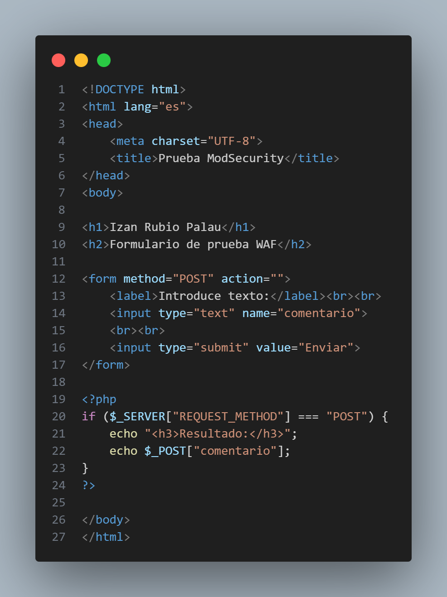
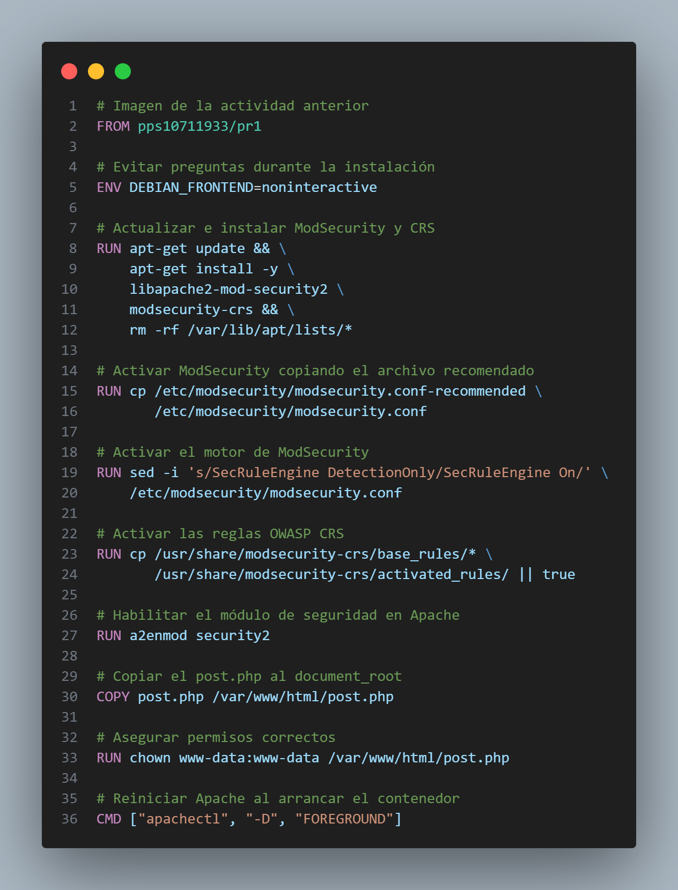
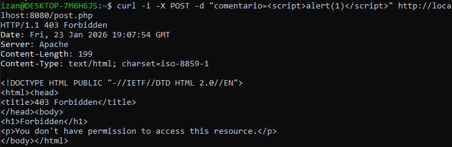

# Apartado 3.1.2 Web Application Firewall

## Introducción

En este apartado se configura un Web Application Firewall (WAF) utilizando ModSecurity sobre un servidor Apache, empaquetando dicha configuración en una imagen Docker.
El WAF permite proteger aplicaciones web frente a ataques comunes como Cross-Site Scripting (XSS) o inyección SQL, siguiendo las reglas del OWASP Core Rule Set (CRS).

## Imagen base utilizada

Se parte de la imagen Docker de la actividad anterior:

```Dockerfile
FROM pps10711933/pr1
```

A esta imagen es a la que se ha añadido ModSecurity.

## Instalación y configuración de ModSecurity

Toda la configuración se ha automatizado mediante un Dockerfile, realizando las siguientes acciones:

1. Instalación de paquetes
    - `libapache2-mod-security2`: módulo ModSecurity para Apache
    - `modsecurity-crs`: conjunto de reglas OWASP Core Rule Set

2. Activación de ModSecurity
    - Se copia el archivo de configuración recomendado:
    ```Dockerfile
    /etc/modsecurity/modsecurity.conf-recommended /etc/modsecurity/modsecurity.conf
    ```
    - Se activa el motor de reglas
    ```Dockerfile
    SecRuleEngine On
    ```
3. Activación de las reglas OWASP CRS

    Las reglas base del OWASP CRS se activan para que ModSecurity pueda detectar ataques conocidos.

## Archivo post.php

Para validar el funcionamiento del WAF se incluye directamente en la imagen un archivo `post.php`, que contiene un formulario vulnerable a XSS de forma intencionada.

Este archivo se copia al `document_root` de Apache (`/var/www/html`) durante la construcción de la imagen.



## Archivo Dockerfile



## Recreación de la práctica

1. Descargar la imagen desde Docker Hub:

    ```bash
    docker pull pps10711933/pr2
    ```

1. Ahora ejecutamos el contenedor, mapeando el puerto 80:
    ```bash
    docker run -d --rm  -p 8080:80 --name PR2 pps10711933/pr2
    ```

1. Comprobar que funciona

    En una terminal de Linux, ejecutaremos el siguiente comando:
    ```bash
    curl -i -X POST --data-urlencode "comentario=<script>alert(1)</script>" http://localhost:8080/post.php
    ```
    ### Resultado esperado

    

    Para estar totalmente seguros podemos revisar los logs:
    ```bash
    docker exec -it PR2 tail -n 30 /var/log/apache2/modsec_audit.log
    ```

    

    En los registros se observa el evento de seguridad, el tipo de ataque detectado y la regla aplicada.
    
Esto nos confirma que **ModSecurity intercepta y bloquea la petición** al detectar un intento de ataque XSS según las reglas OWASP CRS.

## Conclusión

Las pruebas realizadas demuestran que el WAF funciona correctamente, bloqueando peticiones maliciosas y devolviendo un código HTTP 403, protegiendo así la aplicación web frente a ataques comunes.

## Autor

**Izan Rubio Palau**

Estudiante del módulo PPS 25_26