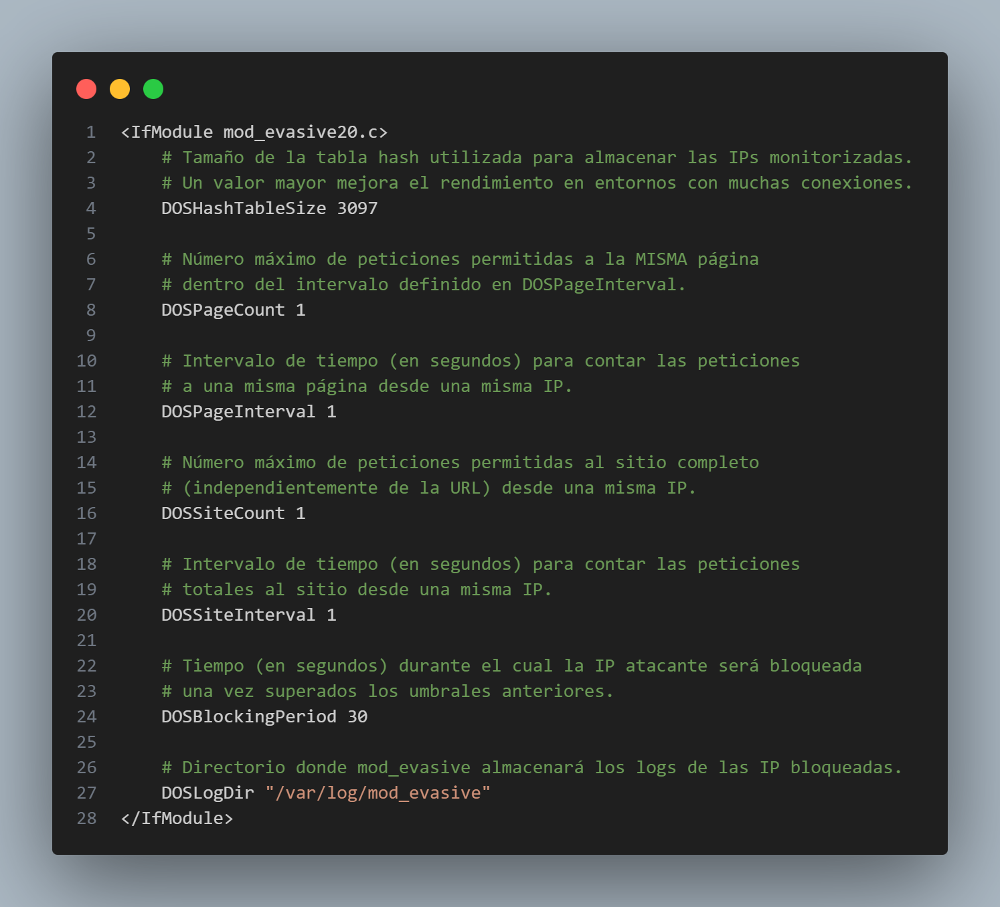

# Apartado 3.1.4 Evitar ataques DDOS

## Introducción

En este apartado se configura el servidor Apache HTTP Server para mitigar ataques de denegación de servicio (DoS) mediante el uso del módulo mod_evasive.
Este módulo monitoriza las peticiones entrantes y bloquea temporalmente aquellas direcciones IP que superan los umbrales definidos, evitando la saturación del servicio.

La solución se integra en una imagen Docker, permitiendo un despliegue rápido y reproducible del entorno de pruebas.

## Imagen base utilizada

Se parte de la imagen Docker de la actividad anterior

```bash
pps10711933/pr3
```

A esta imagen se ha añadido:

1. El módulo libapache2-mod-evasive para la protección frente a ataques DoS.
1. La herramienta apache2-utils, que incluye Apache Bench, para realizar pruebas de carga.
1. Un directorio de logs específico para mod_evasive.

## Instalación y configuración de mod_evasive

La instalación y configuración de `mod_evasive` se realiza íntegramente durante la construcción de la imagen Docker, sin necesidad de intervención manual posterior.

1. Instalación del módulo y herramientas necesarias

    En el Dockerfile se instalan el módulo mod_evasive y la herramienta Apache Bench, utilizada posteriormente para realizar pruebas de carga:

    ```Dockerfile
    RUN apt-get update && \
    apt-get install -y \
    libapache2-mod-evasive \
    apache2-utils && \
    rm -rf /var/lib/apt/lists/*
    ```
   - `libapache2-mod-evasive`: módulo de Apache para mitigar ataques DoS.
   - `apache2-utils`: paquete que incluye la herramienta `ab`.
1. Creación del directorio de logs de mod_evasive

    Se crea el directorio donde mod_evasive almacenará los registros de las IP bloqueadas, asignándole los permisos adecuados al usuario de Apache:

    ```Dockerfile
    RUN mkdir -p /var/log/mod_evasive && \
    chown www-data:www-data /var/log/mod_evasive
    ```

1. Configuración del módulo mod_evasive

    La configuración personalizada del módulo se define en el archivo `evasive.conf`, que se copia directamente al directorio de módulos disponibles de Apache:

    ```Dockerfile
    COPY evasive.conf /etc/apache2/mods-available/evasive20.conf
    ```
    El contenido de **evasive.conf** es el siguiente:
    

    Con esta configuración, una IP que realice peticiones repetidas en un corto intervalo de tiempo será bloqueada durante **30 segundos**.
1. Activación del módulo en Apache

    Finalmente, el módulo `mod_evasive` se habilita explícitamente durante la construcción de la imagen:
    ```Dockerfile
    RUN a2enmod evasive
    ```
    De esta forma, el módulo queda activo automáticamente cada vez que se ejecuta el contenedor.

## Archivo Dockerfile

Se ha creado un Dockerfile específico que hereda de PR3 y realiza la configuración anterior.


## Recreación de la práctica

1. Descargar la imagen desde Docker Hub:
    ```bash
    docker pull pps10711933/pr4
    ```
1. Ejecutar el contenedor, mapeando el puerto HTTP:
    ```bash
    docker run -d --rm -p 8080:80 --name PR4 pps10711933/pr4
    ```
1. Comprobar que el servidor Apache está funcionando:
    ```bash
    curl http://localhost:8080
    ```

### Prueba de mitigación DDos con Apache Bench

Para verificar que el módulo mod_evasive bloquea peticiones masivas, se ha utilizado Apache Bench.

Apache Bench se ejecuta desde el sistema anfitrión para simular múltiples peticiones concurrentes contra el contenedor Docker.

1. Instalaremos Apache Bench
    ```bash
    sudo apt install apache2-utils -y
    ```
    

1. Comprobamos que se ha instalado correctamente:
    ```bash
    ab -V
    ```
    

1. Ahora realizamos la prueba con el siguiente comando:

    ```bash
    ab -n 3000 -c 50 http://localhost:8080/
    ```
    Apache bench nos generará un informe, aquí muestro un fragmento de este:
    
    
    Se puede observar el informe completo en informeApacheBench.txt

#### Resultado del ataque DDoS
Durante la ejecución de la prueba, Apache comienza a rechazar peticiones devolviendo errores 403 Forbidden, lo que confirma que mod_evasive detecta el comportamiento anómalo y bloquea la dirección IP atacante.

## Conclusión

Se ha configurado correctamente un mecanismo de protección frente a ataques de denegación de servicio (DoS) sobre Apache utilizando el módulo mod_evasive, integrándolo en una imagen Docker heredada de PR3.

Las pruebas realizadas muestran que:

- Las peticiones masivas desde una misma IP son bloqueadas automáticamente.

- Apache devuelve respuestas 403 Forbidden al superar los umbrales configurados.

- La solución es sencilla, eficaz y adecuada para entornos de laboratorio de ciberseguridad.

Cabe destacar que mod_evasive mitiga ataques DoS simples basados en una única dirección IP, pero no sustituye a soluciones específicas frente a ataques DDoS distribuidos.

## Autor

**Izan Rubio Palau**

Estudiante del módulo PPS 25_26