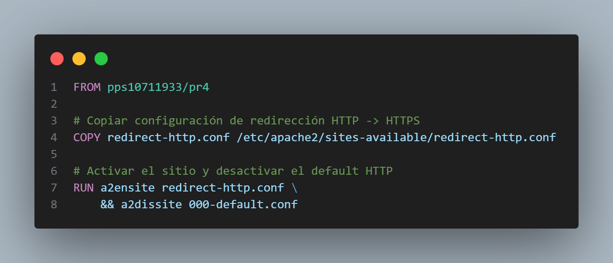
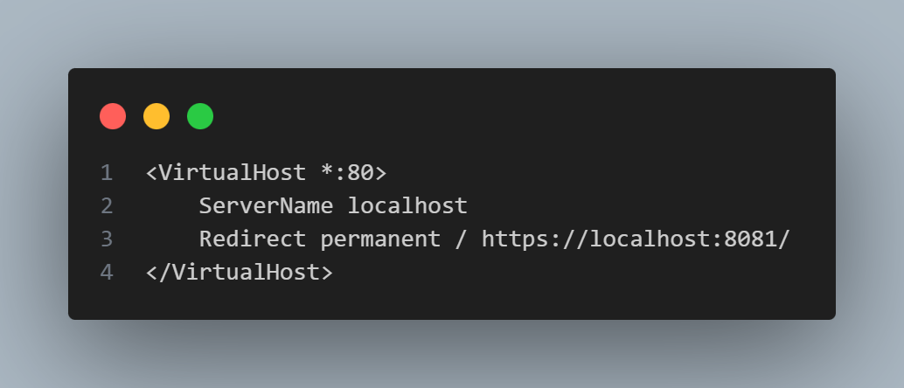
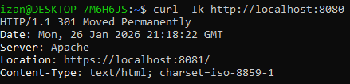
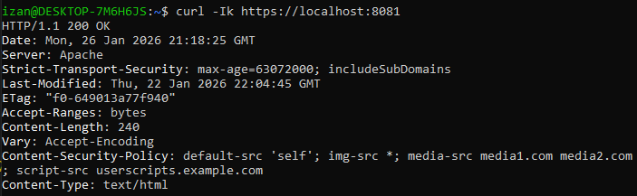

# Apartado 3.2 Certificados

## Introducción

En esta práctica vamos a configurar un servidor Apache dentro de un contenedor Docker, de forma que:
- Todo el tráfico HTTP sea redirigido automáticamente a HTTPS.
- El tráfico HTTPS esté protegido con un certificado SSL autofirmado.
- Se implementen políticas de seguridad adicionales como HSTS y CSP.
La práctica se basa en la actividad 3.1.4-Evitar-ataques-DDOS, anteriormente, en el apartado 3.1.1-CSP ya creamos el certificado SSL autofirmado y configuramos HSTS y CSP en un VirtualHost de Apache, por lo que ahora lo nuevo que he implementado ha sido la redirección de http a https.

## Archivo Dockerfile
El archivo Dockerfile parte de la imagen pps10711933/pr4 de la práctica anterior:



Como se puede observar, tenemos 3 secciones:

1. `FROM pps10711933/pr4`: usamos como base la práctica anterior ya que ya tiene un certificado y los módulos SSL y headers de seguridad configurados.
1. `COPY redirect-http.conf /etc/apache2/sites-available/redirect-http.conf`: Copiamos nuestro archivo de configuración que realiza la redirección HTTP a HTTPS.
1. `RUN a2ensite redirect-http.conf && a2dissite 000-default.conf`: Activamos la redirección y desactivamos la configuración por defecto de Apache en el puerto 80.

## Archivo `redirect-http.conf`

Este archivo contiene el VirtualHost que redirige todo el tráfico HTTP al puerto HTTPS mapeado en Docker:



#### Explicación:

1. `*:80`: Escucha en el puerto HTTP del contenedor
1. `Redirect permanent`: Redirige todas las solicitudes hacia https://localhost:8081/, que es el puerto HTTPS mapeado en el host.
1. Se ha separado este VirtualHost del 443 que se creó en el apartado 3.1.1-CSP, permitiéndonos mantener la configuración HTTPS con HSTS y CSP intacta.

## Certificado SSL

Como se ha mencionado anteriormente, el certificado ya fue creado en la actividad 3.1.1-CSP:
- Se trata de un certificado autofirmado colocado en `/etc/apache2/ssl/`.
- Apache usa ese certificado para cifrar las conexiones HTTPS.
- HSTS y CSP están activos para reforzar la seguridad.
- Al estar el certificado autofirmado los navegadores mostrarán advertencias.

## Recreación de la práctica

Para recrear la actividad hay que seguir los siguientes pasos:

1. Hacer un pull de la imagen final de la práctica 3.2 Certificados

    ```bash
    docker pull pps10711933/pr6
    ```
1. Ejecutar el contenedor exponiendo los puertos que mapeamos:

    ```bash
    docker run -d --rm -p 8080:80 -p 8081:443 --name PR6 pps10711933/pr6
    ```
1. Verificar la redirección HTTP -> HTTPS con curl

    ```bash
    curl -Ik http://localhost:8080
    ```

    La salida esperada:
    

    Si nos fijamos en la imagen, nos indica que la respuesta es `301 Moved Permanently` y, en `Location: https://localhost:8081/`, indica la URL a la que se va a redirigir la solicitud.

1. Verificar la conexión HTTPS y los headers de seguridad:

    ```bash
    curl -Ik https://localhost:8081
    ```

    La salida esperada:
    

    Como se puede apreciar en la imagen, en la primera línea, nos devuelve un **200 OK** con las cabeceras `Strict-Transport-Security` y `Content-Security-Policy`, indicando:
    - Petición HTTPS correcta.
    - Forzado de HTTPS
    - Control de qué recursos externos puede cargar la página

## Conclusión

- La práctica demuestra cómo configurar un contenedor Apache seguro con HTTPS.
- Se ha implementado correctamente una redirección de HTTP a HTTPS sin afectar la configuración HTTPS existente.
- Las políticas de seguridad HSTS y CSP garantizan que las conexiones sean más seguras frente a ataques de tipo man-in-the-middle o contenido externo no deseado.
- Esta configuración es ideal para entornos de práctica o intranet; para un sitio público se debería usar un certificado emitido por una autoridad de certificación confiable.

## Autor

**Izan Rubio Palau**

Estudiante del módulo PPS 25_26