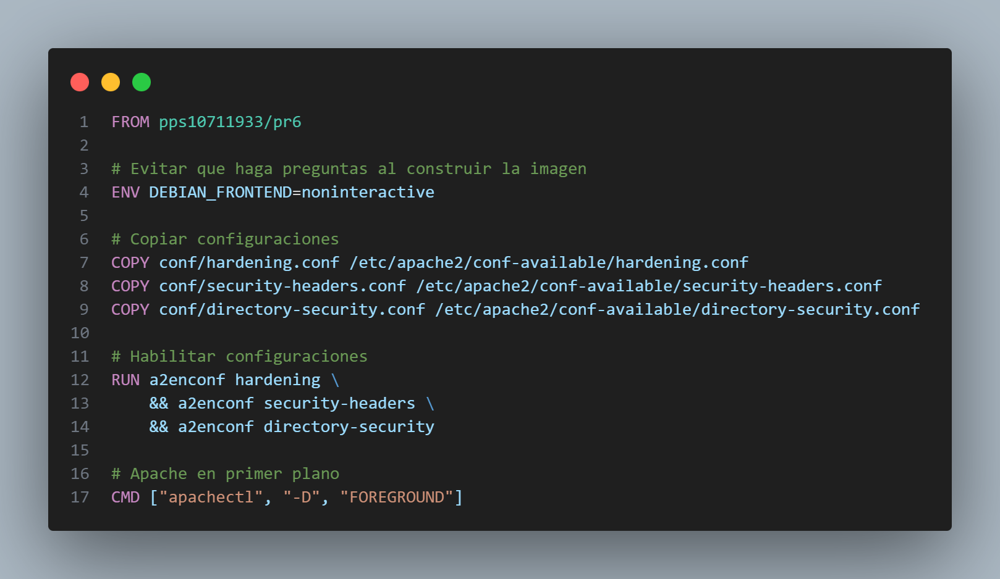
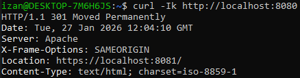
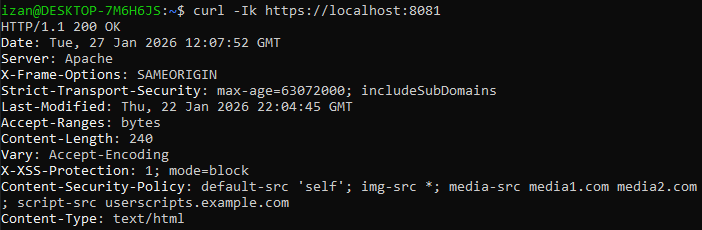
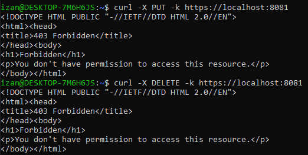

# Apartado 3.3 Apache Hardening Best Practices

## Introducción

En esta actividad se ha realizado un hardening de un servidor Apache desplegado en contenedor Docker, siguiendo buenas prácticas de seguridad para entornos de producción.

El objetivo principal ha sido:

- Forzar HTTPS mediante certificados autofirmados y redirección HTTP -> HTTPS.
- Aplicar **headers de seguridad** (HSTS, X-Frame-Options, X-XSS-Protection, CSP).
- Bloquear métodos HTTP peligrosos (`TRACE`, `PUT`, `DELETE`).
- Activar **ModSecurity** con reglas OWASP CRS y reglas personalizadas para proteger contra ataques web comunes.
- Aplicar configuraciones de **endurecimiento de Apache**, como ocultar información del servidor.

Algunas configuraciones como la instalación de Apache, SSL, ModSecurity y OWASP CRS ya se habían realizado en prácticas anteriores. Por lo tanto, en esta práctica nos centramos en:

- Externalizar la configuración de seguridad en archivos .conf.
- Activar y verificar los headers de seguridad y bloqueo de métodos HTTP peligrosos.
- Comprobar la correcta redirección HTTP -> HTTPS.

## Archivo Dockerfile
El archivo Dockerfile parte de la imagen pps10711933/pr6 de la práctica anterior:



1. Variable de entorno:
    ```Dockerfile
    ENV DEBIAN_FRONTEND=noninteractive
    ```

    - Evitamos preguntas interactivas de apt
    - Ya se había utilizado en prácticas anteriores.

1. Copiar configuraciones de seguridad externas:
    ```Dockerfile
    COPY conf/hardening.conf /etc/apache2/conf-available/hardening.conf
    COPY conf/security-headers.conf /etc/apache2/conf-available/security-headers.conf
    COPY conf/directory-security.conf /etc/apache2/conf-available/directory-security.conf
    ```

    - Externalizamos toda la configuración de seguridad en archivos `.conf`.
    - Facilitamos modificaciones futuras sin tocar el Dockerfile

1. Habilitar configuraciones y módulos de seguridad:
    ```Dockerfile
    RUN a2enconf hardening \
        && a2enconf security-headers \
        && a2enconf directory-security
    ```

    - `a2enconf` activa las configuraciones de los archivos que hemos copiado.
    - `a2enmod` y `a2ensite` ya se habían hecho en la imagen base, pero nos aseguramos que todos los módulos necesarios estén activos.

1. Apache en primer plano
    ```Dockerfile
    CMD ["apachectl", "-D", "FOREGROUND"]
    ```

    - Mantiene Apache en ejecución dentro del contenedor.
    - En todas las prácticas anteriores ya se había realizado así.

## Recreación de la práctica

Para recrear la actividad hay que seguir los siguientes pasos:

1. Hacer un pull de la imagen final de la práctica 3.3 Apache Hardening Best Practices.
    ```bash
    docker pull pps10711933/pr7
    ```

1. Ejecutar el contenedor exponiendo los puertos mapeados:
    ```bash
    docker run -d --rm -p 8080:80 -p 8081:443 --name PR7 pps10711933/pr7
    ```

1. Verificar la redirección HTTP -> HTTPS con `curl`:
    ```bash
    curl -Ik http://localhost:8080
    ```
    La salida esperada:

    

    - La respuesta `301 Moved Permanently` indica que todas las solicitudes HTTP se redirigen automáticamente a HTTPS.
    - El header `Location` indica la URL de destino de la redirección.
    - Esta redirección fue configurada en una práctica anterior, mantenindose activa en esta imagen.

1. Verificar la conexión HTTPS y los headers de seguridad:
    ```bash
    curl -Ik https://localhost:8081
    ```

    La salida esperada:

    

    - Confirma que la página carga correctamente con HTTPS (`200 OK`)
    - `Strict-Transport-Security` (HSTS) obliga al navegador a usar HTTPS.
    - `Content-Security-Policy` (CSP) controla qué recursos externos puede cargar la página, evitando ataques de tipo XSS.
    - `X-Frame-Options` previene que la página sea cargada dentro de frames de otros dominios (clickjacking).
    - `X-XSS-Protection` habilita la protección básica de XSS en varios navegadores.

1. Probar métodos HTTP inseguros para verificar la seguridad

    El servidor fuerza todas las conexiones HTTP a HTTPS mediante la redirección configurada en una práctica anterior.

    Por este motivo, los métodos HTTP inseguros se prueban directamente sobre HTTPS para comprobar que están correctamente bloqueados:

    ```bash
    curl -X PUT -k https://localhost:8081
    curl -X DELETE -k https://localhost:8081
    ```

    La salida esperada:

    

    - Aunque se trate de métodos HTTP inseguros, las solicitudes se realizan sobre HTTPS debido a la redirección forzada.
    - La salida `403 Forbidden` indica que el servidor bloquea correctamente estos métodos potencialmente peligrosos como `PUT` y `DELETE`.

## Conclusión

- Algunas configuraciones, como la redirección HTTP -> HTTPS y la instalación de Apache/SSL, ya se habían realizado en prácticas anteriores. En esta práctica nos hemos centrado en externalizar la seguridad en archivos .conf y activar los headers de seguridad y bloqueo de métodos HTTP inseguros.
- En esta práctica se ha configurado un contenedor Apache seguro sobre HTTPS, integrando hardening básico, cabeceras de seguridad y bloqueo de métodos HTTP inseguros.
- Se ha comprobado que todas las solicitudes HTTP se redirigen automáticamente a HTTPS, garantizando que las conexiones sean seguras.
- Las políticas de seguridad implementadas (`HSTS`, `CSP`, `X-Frame-Options`, `X-XSS-Protection`) refuerzan la protección frente a ataques como **XSS**, **clickjacking** y **interceptación de tráfico**.
- La práctica muestra la importancia de separar la configuración en archivos .conf para facilitar su mantenimiento y futuras modificaciones.
- Aunque esta configuración es segura, se recomienda usar certificados emitidos por una autoridad de certificación confiable y revisar periódicamente las reglas de seguridad.
- Finalmente, la integración de medidas de **hardening**, **seguridad de headers** y **control de métodos HTTP** demuestra cómo construir un entorno web más resistente frente a amenazas comunes.

## Autor

**Izan Rubio Palau**

Estudiante del módulo PPS 25_26